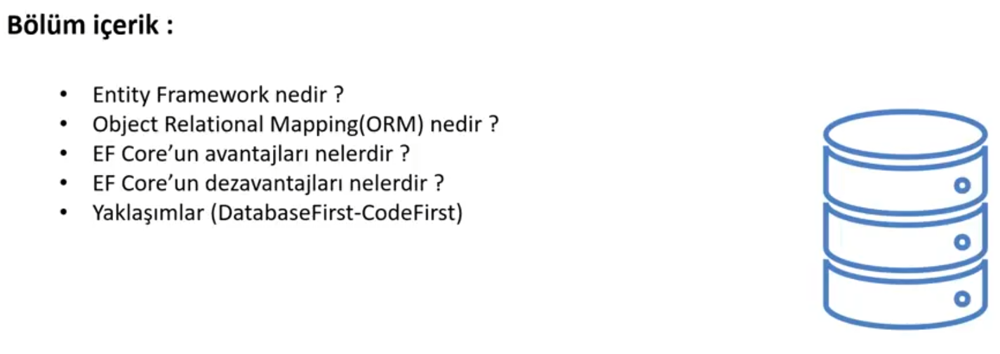

# Entity Framework

# EF Core Nedir ?

### ORM

- Veriye erişim teknolojisi
- Nesne map’leme (Veritabanındaki ilgili tablolara karşılık kod tarafında bir class ile karşılamak - Tablodan her data cekmek istediğimizde o tablodaki datalara karşılık bir class’ın nesne örneğinin üretilmesidir)
- Veri tabanına erişim sağlarken eski usller kullanmak yerine ORM aracı kullanmak hızımızı arttırır. EF Core dışındaki veri erişim teknolojilerinde de kullanılır.

### LINQ

- EF Core’da sorgularımızı yazmak için kullandığımız teknolojidir.
- Sorgulama tekniğidir.
- Dile entegre sorgulama (Kullandığımız C# dilinin özelliklerini kullanarak çeşitli veri kaynaklarına karşı sorgulamalar yazabiliyoruz)
- C# ‘ın başlarında LINQ sorgularının kullanıldığı yerler…
    1. LINQ To Objects Collection → Memory’de tutulan Collection’lara karşılık LINQ sorguları yazabiliyoruz. (List, LinkedList, Dictionary Sınıfları, Array, Memoryde Tutulan Objeler)
        - LINQ tip güvenli bir şekilde sorgular yazmamızı sağlar. (Program çalıştırılmadan derleme sırasında derleyici yanlış yazımları uyarır)
    2. LINQ to XML 
    3. LINQ to Entities 

EF Core ile sadece tip güvenli bir sorgular yazmak zorunda değiliz. Ham SQL cümlecikleri de yazabiliriz. 

---

### Entities

- Bir class ‘dır.
- Diğer class ‘lardan farklı olarak veri tabanında bir tablo karşılığı vardır. ( Örneğin, Product class’ına karşılık veri tabanında Product tablosu vardır)

---

# ORM Nedir ?

ORM nesne mapleme tekniğidir. 

EF Core gibi Hibernate gibi veriye erişimi soyutlayan ve nesneye map ‘leyen kütüphaneler ORM aracı olarak adlandırılır.

context → Veritabanı

User → Veritabanındaki tablo

Ef Core, User tablosu üzerinde listeleme yaptığımızda yani bu tablodan data almak istediğimizde; tablodaki her bir satıra karşılık User Class ‘ından nesne örneği üretir.

User class ‘ındaki her bir property User tablosunda bir sutuna karşılık gelir.

1. id Id property’sine, name Name property’sine email Email property’sine maplenir. 
2. Her satırdan User nesne örneği oluşturur. 
3. Daha sonra tüm User ‘ları istediğimizde bu User ‘lardan liste oluşturulur.

---

<aside>

📌 Tip güvenli çalışmak projenin sürdürülebilirliğini arttırır. Hatalar henüz derleme aşamasında farkedilir.

</aside>

---

# EF Core Yaklaşımları

<aside>

📌 Best practice “Code First” dür.

</aside>