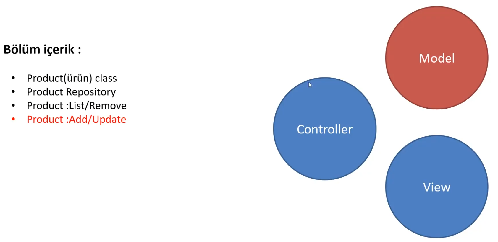

# Model




```csharp
// Product.cs
namespace MyAspNetCoreApp.Web.Models
{
    public class Product
    {
        public int Id { get; set; }

        public string Name { get; set; }

        public decimal Price { get; set; }

        public int Stock { get; set; }

    }
}
```


```csharp

// ProductRepository.cs

using MyAspNetCoreApp.Web.Models;

namespace MyAspNetCoreApp.Web.Models
{
    public class ProductRepository
    {
        // liste oluşturma
        /* statik yapıldı çünkü uygulama ayağa kalkınca memoryde olsun ve
        uygulama kapanana kadar bu listeleme üzerinden çalışabilelim */

        private static List<Product> _products = new List<Product>()
        {
            new () { Id = 1, Name = "Kalem1", Price = 100, Stock = 200 },
            new () { Id = 2, Name = "Kalem2", Price = 200, Stock = 400 },
            new () { Id = 3, Name = "Kalem3", Price = 300, Stock = 600 }
        };

        /* static olan bir uyeye direkt olarak class ismi üzerinden erişebiliriz nesne
        örneği almamıza gerek yoktur. Fakat şuan privite olduğu içimn şuanda her class tarafından
        erişilemeyecek bu nedenle listemizi aşağıdaki tanımladığımız methodlar ile dış dünyaya açacağız
        yani başka classlar bu repository üzerinde işlem yapabilecek*/

        /*
        private List<Product> GetAll()
        {
            return _products;
        }
        */

public List<Product> GetAll() => _products;

        public void Add(Product newProduct) => _products.Add(newProduct);

        public void Remove(int id)
        {
            var hasProduct = _products.FirstOrDefault(x => x.Id == id);

            if(hasProduct == null)
            {
                throw new Exception($"Bu id({id}) 'ye sahip ürün bulunmamaktadır !");
            }

            _products.Remove(hasProduct);
        }

        public void Update(Product updateProduct)
        {
            var hasProduct = _products.FirstOrDefault(x => x.Id == updateProduct.Id);

            if (hasProduct != null)
            {
                throw new Exception($"Bu id({updateProduct.Id}) 'ye sahip ürün bulunmamaktadır !");
            }

            hasProduct.Name = updateProduct.Name;
            hasProduct.Price = updateProduct.Price;
            hasProduct.Stock = updateProduct.Stock;

            var index = _products.FindIndex(x => x.Id == updateProduct.Id);

            _products[index] = hasProduct;
        }

    }
}
```


```csharp
// ProductsController.cs 

using Microsoft.AspNetCore.Mvc;
using MyAspNetCoreApp.Web.Models;

namespace MyAspNetCoreApp.Web.Controllers
{
    public class ProductsController : Controller
    {
        private readonly ProductRepository _productRepository;

        public ProductsController()
        {
            _productRepository = new ProductRepository(); //nesne örneği
        
        }

        public IActionResult Index()
        {
            var products = _productRepository.GetAll();

            return View(products);
        }

        // Silme işlemi View'den controller'a veri göndermektir.
        public IActionResult Remove(int id)
        {
            _productRepository.Remove(id);

            return RedirectToAction("Index"); //action methoda yönlendirir (index sayfasına yönlendirir)

        }
    }
}
```

```csharp
// Products
// index.cshtml

@{
    ViewData["Title"] = "Index";
}

<h1>Index</h1>

<br />

@model List<Product>

<h1>Ürünler</h1>

<table class="table"> @*bootstrap*@
    <thead>
        <th>Id</th>
        <th>İsim</th>
        <th>Fiyat</th>
        <th>Stok</th>
        <th>İşlem</th>
    </thead>

    <tbody>
    @foreach (var item in Model)
    {
        <tr>
            <td>@item.Id</td>
            <td>@item.Name</td>
            <td>@item.Price</td>
            <td>@item.Stock</td>
            <td><a asp-controller="products" asp-action="remove" asp-route-id="@item.Id">Sil</a></td>
        </tr>
    }
    </tbody>
</table>
```


### Add/Update Action Method'un oluşturulması

```csharp
// ProductsController.cs 

using Microsoft.AspNetCore.Mvc;
using MyAspNetCoreApp.Web.Models;

namespace MyAspNetCoreApp.Web.Controllers
{
    public class ProductsController : Controller
    {
        private readonly ProductRepository _productRepository;

        public ProductsController()
        {
            _productRepository = new ProductRepository(); //nesne örneği
        
        }

        public IActionResult Index()
        {
            var products = _productRepository.GetAll();

            return View(products);
        }

        // Silme işlemi View'den controller'a veri göndermektir.
        public IActionResult Remove(int id)
        {
            _productRepository.Remove(id);

            return RedirectToAction("Index"); //action methoda yönlendirir (index sayfasına yönlendirir)

        }

        public IActionResult Add()
        {
            return View();

        }

        //pattern: "{controller=Home}/{action=Index}/{id?}");
        //id
        public IActionResult Update(int id)
        {
            return View();

        }

    }
}
```


```csharp
@{
    ViewData["Title"] = "Index";
}

<h1>Index</h1>

<br />

@model List<Product>

<h1>Ürünler</h1>
<td><a asp-controller="products" asp-action="add">Ürün Ekle</a></td>
<table class="table"> @*bootstrap*@
    <thead>
        <th>Id</th>
        <th>İsim</th>
        <th>Fiyat</th>
        <th>Stok</th>
        <th>İşlem</th>
    </thead>

    <tbody>
    @foreach (var item in Model)
    {
        <tr>
            <td>@item.Id</td>
            <td>@item.Name</td>
            <td>@item.Price</td>
            <td>@item.Stock</td>
            <td>
                <a asp-controller="products" asp-action="remove" asp-route-id="@item.Id">Sil</a>
                <a asp-controller="products" asp-action="update" asp-route-id="@item.Id">Güncelle</a>
            </td>
        </tr>
    }
    </tbody>
</table>
```


<aside>

➡️ Şuan Ürün Ekle ve Güncelle pasif halde !

</aside>