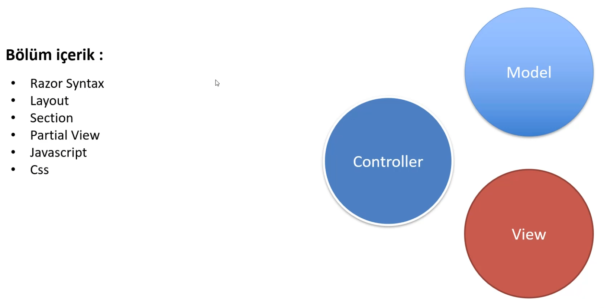

# View




```html
<!-- _Layout.cshtml -->

<!DOCTYPE html>
<html lang="en">
<head>
    <meta charset="utf-8" />
    <meta name="viewport" content="width=device-width, initial-scale=1.0" />
    <title>@ViewData["Title"] - MyAspNetCoreApp.Web</title>
    <link rel="stylesheet" href="~/lib/bootstrap/dist/css/bootstrap.min.css" />
    <link rel="stylesheet" href="~/css/site.css" asp-append-version="true" />
    <link rel="stylesheet" href="~/MyAspNetCoreApp.Web.styles.css" asp-append-version="true" />
</head>
<body>
    <header>
        <nav class="navbar navbar-expand-sm navbar-toggleable-sm navbar-light bg-white border-bottom box-shadow mb-3">
            <div class="container-fluid">
                <a class="navbar-brand" asp-area="" asp-controller="Home" asp-action="Index">MyAspNetCoreApp.Web</a>
                <button class="navbar-toggler" type="button" data-bs-toggle="collapse" data-bs-target=".navbar-collapse" aria-controls="navbarSupportedContent"
                        aria-expanded="false" aria-label="Toggle navigation">
                    <span class="navbar-toggler-icon"></span>
                </button>
                <div class="navbar-collapse collapse d-sm-inline-flex justify-content-between">
                    <ul class="navbar-nav flex-grow-1">
                        <li class="nav-item">
                            <a class="nav-link text-dark" asp-area="" asp-controller="Home" asp-action="Index">Home</a>
                        </li>
                        <li class="nav-item">
                            <a class="nav-link text-dark" asp-area="" asp-controller="Home" asp-action="Privacy">Privacy</a>
                        </li>
                    </ul>
                </div>
            </div>
        </nav>
    </header>
    <div class="container">
        <main role="main" class="pb-3">
            **@**RenderBody()                                                                 
        </main>
    </div>

    <footer class="border-top footer text-muted">
        <div class="container">
            &copy; 2022 - MyAspNetCoreApp.Web - <a asp-area="" asp-controller="Home" asp-action="Privacy">Privacy</a>
        </div>
    </footer>
    <script src="~/lib/jquery/dist/jquery.min.js"></script> 
    <script src="~/lib/bootstrap/dist/js/bootstrap.bundle.min.js"></script>
    <script src="~/js/site.js" asp-append-version="true"></script>
    @await RenderSectionAsync("Scripts", required: false)
</body>
</html>
```

@RenderBody() → .cshtml uzantılı dosyaları çalıştırır.

```csharp
//_ViewStart.cshtml

@{
    Layout = "_Layout";
}

// .cshtml dosyaları için default Layout _Layout.cshtml olarak belirleniyor.
```

---

### Farklı Layout Kullanma


```html
<!-- ExampleLayout.cshtml -->
<!DOCTYPE html>
<html lang="en">
<head>
    <meta charset="utf-8" />
    <meta name="viewport" content="width=device-width, initial-scale=1.0" />
    <title>@ViewData["Title"] - MyAspNetCoreApp.Web</title>

</head>
<body>
    <header>
        <div>
            Header
        </div>
    </header>

    <div class="container">
        <main role="main" class="pb-3">
            @RenderBody()
        </main>
    </div>

    <footer>
        <div>
            Footer
        </div>
    </footer>
   
</body>
</html>
```

```csharp
// ExampleController.cs
using Microsoft.AspNetCore.Mvc;

namespace MyAspNetCoreApp.Web.Controllers
{
    public class ExampleController : Controller
    {
        public IActionResult Index()
        {
            return View();
        }
    }
}
```

```csharp
// Example
// Index.cshtml
@{
    ViewData["Title"] = "ExampleController.cs Index Sayfası";
    
    Layout = "ExampleLayout";
}

<div>
    Bu sayfa ExampleController.cs Index sayfasıdır.
</div>
```


---

### Layout Kullanmayan Sayfa


[https://www.notion.so](https://www.notion.so)


```csharp
// NoLayout.cshtml

@{
    Layout = null;
}

<!DOCTYPE html>

<html>
<head>
    <meta name="viewport" content="width=device-width" />
    <title>NoLayout</title>
</head>
<body>

    <dib>
        Bu sayfa Layout sayfalarından beslenmemektedir.
    </dib>

</body>
</html>
```


---

### ****Render Section Nedir ? Nasıl Tanımlanır ?****

```csharp
<!-- ExampleLayout.cshtml -->

<!DOCTYPE html>
<html lang="en">
<head>
    <meta charset="utf-8" />
    <meta name="viewport" content="width=device-width, initial-scale=1.0" />
    <title>@ViewData["Title"] - MyAspNetCoreApp.Web</title>

</head>
<body>
    <header>
        <p>Header</p>
        @await RenderSectionAsync("header", required: false)
    </header>

    <div class="container">
        <main role="main" class="pb-3">
            @RenderBody()
        </main>
    </div>

    <footer>
        <p>Header</p>
        @await RenderSectionAsync("footer", required: false)
    </footer>
   
</body>
</html>
```

```csharp
// Example
// Index.cshtml
@{
    ViewData["Title"] = "ExampleController.cs Index Sayfası";
    
    Layout = "ExampleLayout";
}

@section header{
    <p>Bu kodlar header alanına eklenecek.</p>
}

@section footer{
    <p>Bu kodlar footer alanına eklenecek.</p>
}

<div>
    Bu sayfa ExampleController.cs Index sayfasıdır.
</div>
```

