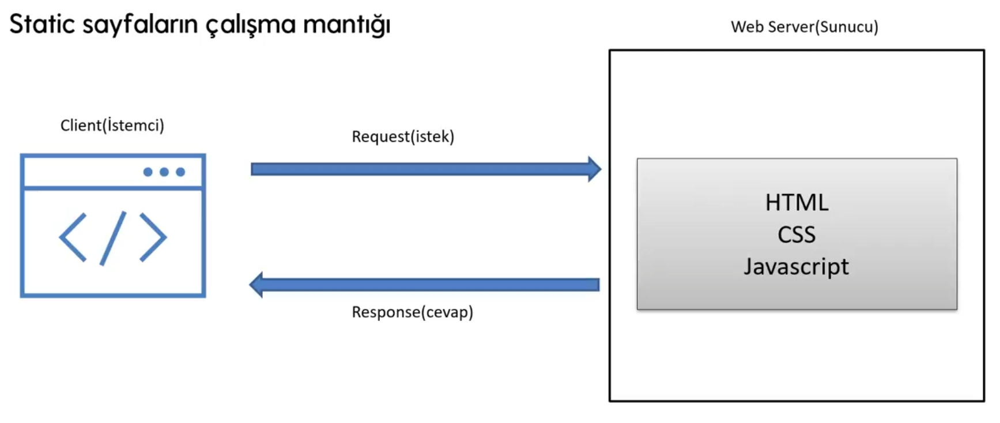

# Asp.Net Core MVC

### SDK Nedir ?

.Net uygulaması geliştirmek için gerekli olan kütüphane veya araç setidir.

### Runtime nedir ?

.Net ile geliştirilmiş bir uygulamanın çalışmasına imkan veren ortamdır.

## MVC Design Pattern

Design Pattern, yazılım dünyasında sıkça karşılaşılan ve birbirine benzeyen problemleri çözmek için geliştirilmiş kalıplardır.

MVC Design Pattern, ASP.NET Core Web Uygulamları geliştirmek için kullanılan ana tasarım desenidir.

“Seperation Of Concern” ilgili kodun ilgili yerde bulunmasıdır.

Model, iş kurallarının tanımlandığı yerdir.  Ayrıca veritabanı ile ilgili sürecleri yönetir.

Örneğin; 

Site üzerinden kullanıcıdan T.C Kimlik No alındı. Kullanıcının girdiği T.C Kimlik no doğru mu ? Bunun test edildiği yerledir.

View, Web sayfasının kullanıcıya görünmesini sağlamaktan sorumlu olan yerdir.

Controller, MVC Design Pattern’de yönetici pozisyonundadır. Kullanıcı ile direkt iletişime geçilen yerdir.

Örneğin; 

- Kullanıcı bir butona tıkladığında, başka bir sayfaya gitmek istediğinde bu request ilk olarak controller’a gelir.
- Kullanıci bir ayakkabı satım sitesinde tüm ürünleri görmek istesin… Bu istek ilk olarak controller’a gelir. Controler bu istegin veri tabanı ile iletişimi olacak mı buna karar verir.
    
    Veriler veri tabanından geleceğinden Model katmanına istek yapılır. Kullanıcının istediği datalar Model katmanından istenilir.  Eğer iş kurallarımız varsa model katmanı bu kuralların uygulanamasını da sağlar. 
    
    Controller, Model katmanından aldığı bilgiy View katmanına gönderir. View katmanı ise aldığı datayı HTML-CSS-JavaScript kodlarına ekler. View katmanı da bu kodları tarayıcıya gönderir bu sayede kullanıcının önüne istediği sayfa çıkmış olur.
    

---

Model katmanı Controller ve View ‘den bağımsız olarak test edilebilir. (Çünkü Model katmanı bir adım atarken diğerleriyle iletişim kurma gibi bir durumu yok.)

[Controller](Notes/controller/README.md)